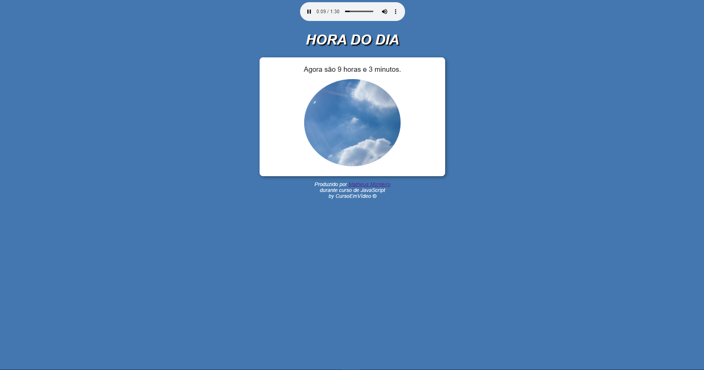
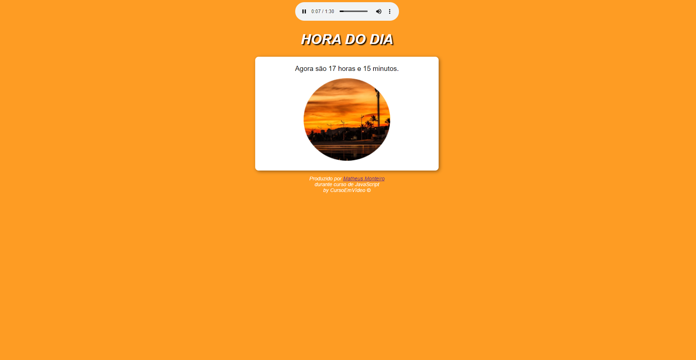
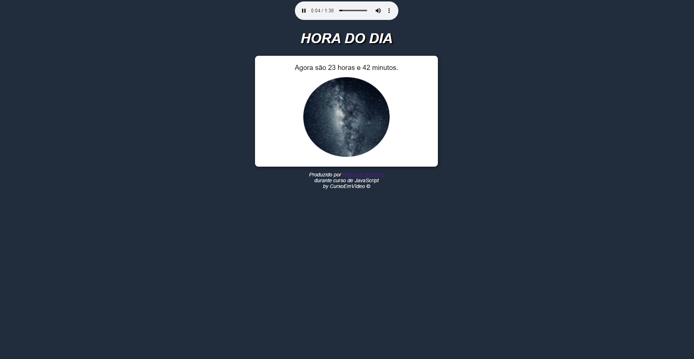

# daytime-javascript
🗒 Small application using JavaScript, which shows the time according to the personal computer time of the user.
 
By <a href="https://www.cursoemvideo.com/">CursoEmVideo</a>

<h1> Preview 01 (Morning) </h1>

 
<h1> Preview 02 (Afternoon) </h1> 

 
<h1> Preview 03 (Night) </h1> 

